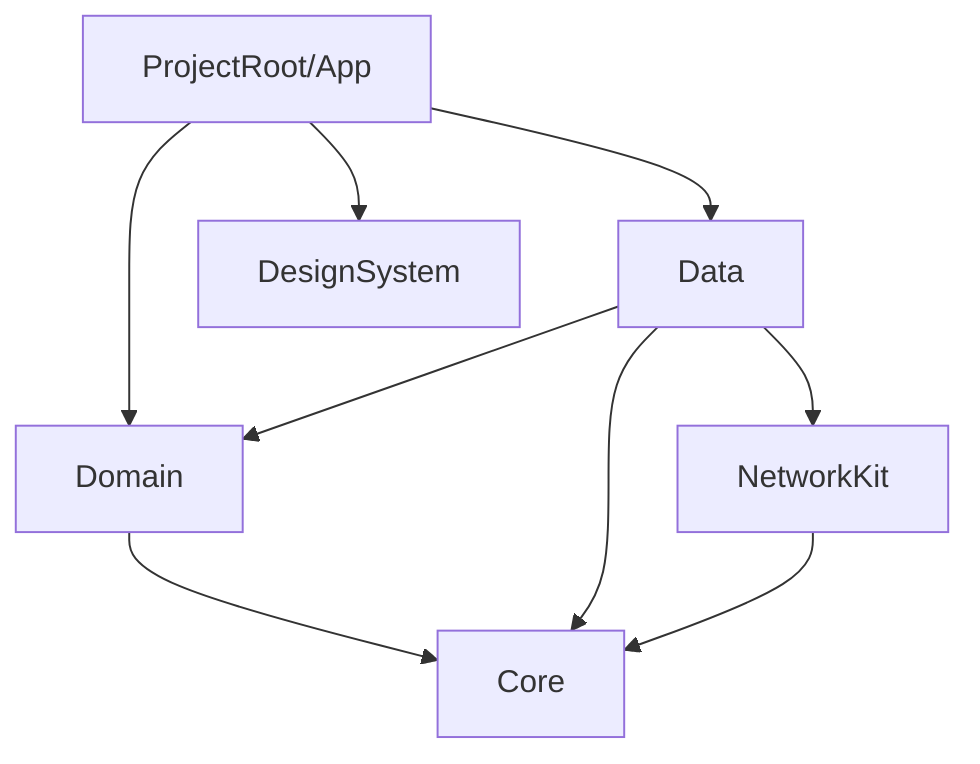

# iOS Modular Architecture Plan

## 1. Overview

The goal is to build a highly scalable, maintainable, and testable iOS application. The architecture embraces a hybrid modularization strategy: **Views and ViewModels reside entirely within the main application target (`App`)**, while all underlying infrastructure, business logic, and UI primitives are extracted into **independent, isolated Swift Packages**.

**Core Philosophy:**
- **UI and Presentation in App Target:** The main Xcode project holds all SwiftUI Views, ViewModels, and Navigation routing. This reduces SPM overhead and simplifies Xcode Previews.
- **Categorized Packages:** Packages are strictly divided into **Agnostic** (reusable in *any* app) and **Product-Specific** (reusable across targets within *this* app's ecosystem, e.g., iOS, watchOS, Widgets).
- **Strict One-Way Dependencies:** The App target depends on the Packages. Packages never depend on the App target. Higher-level packages (Data) depend on lower-level packages (Domain), but never vice versa.

---

## 2. Structural Breakdown

### The Main App Target (Presentation Layer)
Contains everything related to the user experience and application glue.
* **Features:** Grouped by feature (e.g., `Login`, `Home`, `Profile`). Inside each feature folder are the corresponding `View`s and `ViewModel`s.
* **Navigation:** Handles overarching app state and routing (e.g., Authenticated vs Unauthenticated flows).
* **Dependency Injection (DI):** Initializes Repositories and Use Cases from the Packages, injecting them into the ViewModels.

### The Isolated Packages (Reusable Components)
These packages are decoupled from the UI. They fall into two distinct categories based on reusability:

#### Category A: Agnostic Packages (Universal Reusability)
You can drag-and-drop these into a completely different app (e.g., moving them from a Fitness App to an E-Commerce App) without any changes.
* **DesignSystem:** Colors, fonts, spacing, reusable UI components (custom buttons, text styles). *Depends on SwiftUI/UIKit only.*
* **NetworkKit:** API client, request builders, interceptors, error handling, retry logic. *No app-specific models.*
* **Core (or Utilities):** Shared Swift extensions, logging, date formatters. *Keep tightly scoped.*

#### Category B: Product-Specific Packages (Ecosystem Reusability)
These contain business logic tied to *this specific product*. While you can't drop them into a different app, packaging them allows you to cleanly share logic across App Clips, watchOS apps, and Widgets, while enforcing strict compile-time boundaries.
* **Domain Package (Business Logic):** 
  * **Entities:** Pure Swift structs representing core business concepts.
  * **Use Cases (Interactors):** The business logic rules (e.g., `GetUserUseCase`).
  * **Protocols (Interfaces):** Interface definitions for repositories (e.g., `UserRepository`).
  * **Rules:** `Domain` is 100% testable, does NOT import UI frameworks, and does NOT know about the network or databases.
* **Data Package:** 
  * The implementation of the exact rules dictated by the Domain Layer.
  * **Repository Implementations:** Concrete implementations of the protocols defined in the `Domain`.
  * **API Implementations:** Calls outward to `NetworkKit`.

---

## 3. Dependency Flow Rules

Strict enforcement of the dependency graph ensures the packages remain highly portable.



**ABSOLUTE RULES:**
1. 🚫 **Packages → App:** A Package must NEVER import or know about the App target. All packages must compile entirely independently.
2. 🚫 **Domain → Network/UI:** Domain MUST NEVER import `NetworkKit` or `DesignSystem`. It is pure Swift.
3. 🚫 **DesignSystem → Domain:** The UI primitives must remain blissfully unaware of business logic.

---

## 4. Advanced: Database Swapping (CoreData vs Realm)

This architecture allows the application to support multiple local databases (like CoreData and Realm) simultaneously and allows the user to select which one to use at runtime. This highlights the power of the **Repository Pattern**.

### #### The Strategy: Protocol-Oriented Data Access

Because your `Domain` layer defines *what* is needed, and the `Data` layer defines *how* to get it, the UI never knows whether the data came from Realm, CoreData, or an API.

#### 1. In the `Domain` Package (The Contract)
```swift
// Domain/Interfaces/UserRepository.swift
public protocol UserRepository {
    func save(user: User) async throws
    func fetchUser(id: String) async throws -> User
}
```

#### 2. In the `Data` Package (The Implementations)
Create two distinct classes that conform to this protocol. One uses CoreData, the other uses Realm.
```swift
// Data/Repositories/CoreDataUserRepositoryImpl.swift
import CoreData // Allowed here

public final class CoreDataUserRepositoryImpl: UserRepository {
    public func save(user: User) async throws { /* CoreData logic */ }
    public func fetchUser(id: String) async throws -> User { /* CoreData logic */ }
}

// Data/Repositories/RealmUserRepositoryImpl.swift
import RealmSwift // Allowed here

public final class RealmUserRepositoryImpl: UserRepository {
    public func save(user: User) async throws { /* Realm logic */ }
    public func fetchUser(id: String) async throws -> User { /* Realm logic */ }
}
```

#### 3. In the Main `App` Target (The Decision Maker)
The App reads the user's settings and injects the chosen implementation.

```swift
// App/DI/DIContainer.swift
class DIContainer {
    func makeHomeViewModel() -> HomeViewModel {
        let databasePreference = UserDefaults.standard.string(forKey: "db_choice") ?? "CoreData"
        let repository: UserRepository
        
        if databasePreference == "Realm" {
            repository = RealmUserRepositoryImpl()
        } else {
            repository = CoreDataUserRepositoryImpl()
        }
        
        // The Domain use case doesn't care which one we picked!
        let getUserUseCase = GetUserUseCase(repository: repository)
        return HomeViewModel(getUserUseCase: getUserUseCase)
    }
}
```

---

## 5. Advanced: Offline-First & Background Sync

If you want the app to save changes locally when offline and automatically sync to the server when the network becomes available, you must implement an **Offline-First (or Single Source of Truth)** strategy. 

In this architecture, this logic belongs entirely in the **Data Layer**. Your `Domain` use cases should not care *how* synchronization happens.

### The Strategy: The "Syncing Repository"
1. `ViewModel` calls `Domain.SaveUserUseCase`.
2. `SaveUserUseCase` calls `UserRepository.save()`.
3. The concrete implementation in the `Data` Package takes over, saving locally first, then queueing a sync.

```swift
// Data/Repositories/OfflineFirstUserRepositoryImpl.swift

public final class OfflineFirstUserRepositoryImpl: UserRepository {
    private let localSyncDB: LocalDatabase // Reals or CoreData wrapper
    private let api: APIClient
    private let syncManager: SyncManager // Background queue manager
    
    public init(localDB: LocalDatabase, api: APIClient, sync: SyncManager) { ... }
    
    public func save(user: User) async throws {
        // 1. ALWAYS save locally first (Single Source of Truth)
        try await localSyncDB.save(user: user)
        
        // 2. Queue the sync operation
        // If online, it sends exactly now. If offline, it saves the "action" to complete later.
        syncManager.queueOperation(type: .updateUser, payload: user)
    }
    
    public func fetchUser(id: String) async throws -> User {
        // 1. Fetch from local DB immediately to show UI fast
        return try await localSyncDB.fetchUser(id: id)
    }
}
```

### Background Sync Manager (Data Package)
* **What it does:** Uses `NWPathMonitor` to listen for connectivity changes. When the connection is restored, it fetches pending operations from the local queue (a `SyncTask` table in Realm/CoreData) and executes them against `NetworkKit`.
* **Waking up:** In the `App` layer, you register an iOS `BGAppRefreshTask`. When iOS wakes the app up in the background, the `App` layer tells the `Data` package's `SyncManager` to process the queue immediately.

### Summary of the Data Flow
1. **UI / App Module:** "Here, I saved a profile. I don't care what happens next."
2. **Data Module (Repository):** "I saved it to Realm. UI can update immediately. I'll add a 'sync' job to the queue."
3. **Data Module (SyncWorker):** "I see a new job. Oh, we have no internet. I'll hold onto it."
4. *(Later in the background)*
5. **App Module (NWPathMonitor):** "Internet is back!" -> Tells `SyncWorker` to start.
6. **Data Module (SyncWorker):** "Sending cached profile updates to the server..."
